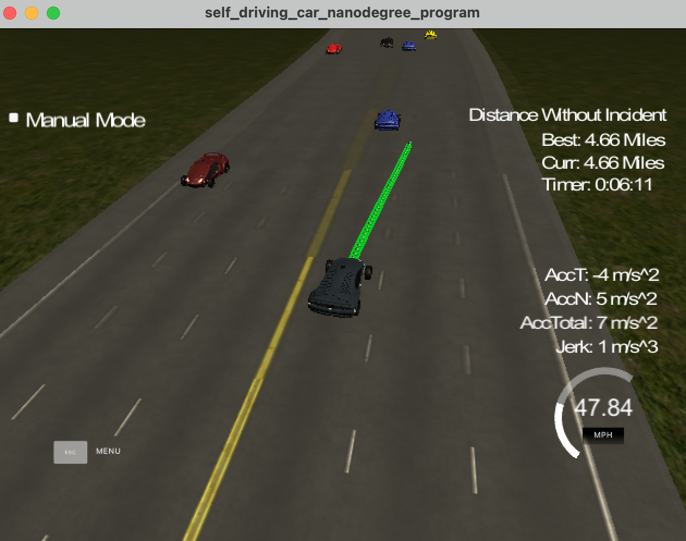
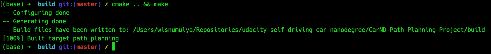

# Path Planning Project Writeup #

-------------------------------------------------------------------------------



## Compilation ##

### 1. The code compiles correctly. ###



As the image above shown, the code can be successfully compiled with `cmake` and `make`.

## Valid Trajectories ##

### 1. The car is able to drive at least 4.32 miles without incident. ###

As the image at the top of this file shows, the ego car is able to drive at least 4.32
mile without any incident.

### 2. The car drives according to the speed limit. ###

The code at line 254-258 of `main.cpp` ensures that the ego car would not drive
exceeding the speed limit set at line 108 of `main.cpp`. Here's the code snippet:

```cpp
// Set target velocity
double target_velocity = 49.5;

// ...

// Slows down if there's a car too close or speeds up otherwise
if (is_too_close) {
	ref_velocity -= .224;
} else if (ref_velocity < target_velocity) {
	ref_velocity += .224;
}
```

### 3. Max Acceleration and Jerk are not Exceeded. ###

The same code for the rubric above applies to ensure that the car wouldn't exceed the
maximum acceleration, by setting the velocity incrementally by `.224` per .02 seconds
(which translates to 4.48 m/s^2).

As for the jerk, some minimization measure has been conducted by using the spline
interpolation library, as suggested in the classroom. The implementation of this could
be seen in the code from line 169-275 of `main.cpp`.

What basically has been done with the spline interpolation library is to append new
path points to the old one, by using spline interpolation which has been fed several
points of the old path and several points of the path planned to be taken in the future.

This interpolation is then splitted to a number of points which would ensure that the
path would be smooth and not exceeding the maximum acceleration nor jerk. This specific
technique could be seen at line 241-244 of `main.cpp` and line 260-262 of `main.cpp`.

### 4. Car does not have collisions. ###

The code at line 120-154 of `main.cpp` ensures to flag whether there's a car in front
of the ego car, or there's one on the left or right side. The flags for these states
are `is_too_close`, `is_car_left`, and `is_car_right`. Also, the way to determine
each state could be seen in the following code snippet:

```cpp
for (int i = 0; i < sensor_fusion.size(); i++) {
	// Grab sensor fusion measurement of a car
	sf_vx = sensor_fusion[i][3];
	sf_vy = sensor_fusion[i][4];
	sf_velocity = sqrt(pow(sf_vx, 2) + pow(sf_vy, 2));
	sf_s = sensor_fusion[i][5];
	sf_d = sensor_fusion[i][6];
	s_future = sf_s + ((double)previous_path_size * .02 * sf_velocity);
	      
	// Check if a car is in ego car's lane
	if ((sf_d < 2 + (lane * 4) + 2) && (sf_d > 2 + (lane * 4) - 2)) {
		// Check if a car's future position would be too close to the ego car's end path waypoint
	    if ((s_future > car_s) && (s_future - car_s < 30)) {
			is_too_close = true;
	    }
	}

	// Check if there's a car on the left lane
	else if ((sf_d < lane * 4) && (sf_d > (lane * 4) - 4)) {
		// Check if the car on the left lane prevents ego car to change lane
	    // (whether the car is 20m in front or behind the ego car).
	    if (abs(s_future - car_s) < 20) {
			is_car_left = true;
	    }
	}

	// Check if there's a car on the right lane
	else if ((sf_d < (lane * 4) + 8) && (sf_d > (lane * 4) + 4)) {
	    // Check if the car on the right lane prevents ego car to change lane
	    // (whether the car is 20m in front or behind the ego car)
	    if (abs(s_future - car_s) < 20) {
			is_car_right = true;
	    }
	}
}
```

If there's a car too close in front of the ego car, the code as shown at rubric 2.2
would slow down the car. Also, the other two flags ensure that the ego car would be
safe to change lane.

### 5. The car stays in its lane, except for the time between changing lanes. ###

A lane initialization is introduced at line 55 of `main.cpp` to ensure that the car would
stay in its initial lane, as long as there's no need to change lane.

The code for lane changing also ensures that the egor car would stay on its lane, as long
as there's no car in front of it that's too close, as shown at line 156-166 of `main.cpp`
and the code snippet at the rubric below.

### 6. The car is able to change lanes ###

The logic regarding lane changing could be seen at line 156-166 of `main.cpp` and the
code snippet below:

```cpp
// Change lane if there's a car too close and it's safe
if (is_too_close) {
	// If it's safe to turn left and the ego is not on the leftmost lane
	if (!is_car_left && (lane != 0)) {
		lane -= 1;
	}
	// If it's safe to turn right and the ego is not on the rightmost lane
	else if (!is_car_right && (lane != 2)) {
	    lane += 1;
	}
}
```

Basically, the code tells the ego car to change lane if there's a car in front of it
that's too close and if lane changing is safe, as indicated by the flags `is_car_left`
and `is_car_right`.

## Reflection ##

### 1. There is a reflection on how to generate paths. ###

You're seeing one!

## Acknowledgements ##
* Classroom project walkthrough
* Thread in the Udacity Knowledge area: [https://knowledge.udacity.com/questions/400376](https://knowledge.udacity.com/questions/400376).
